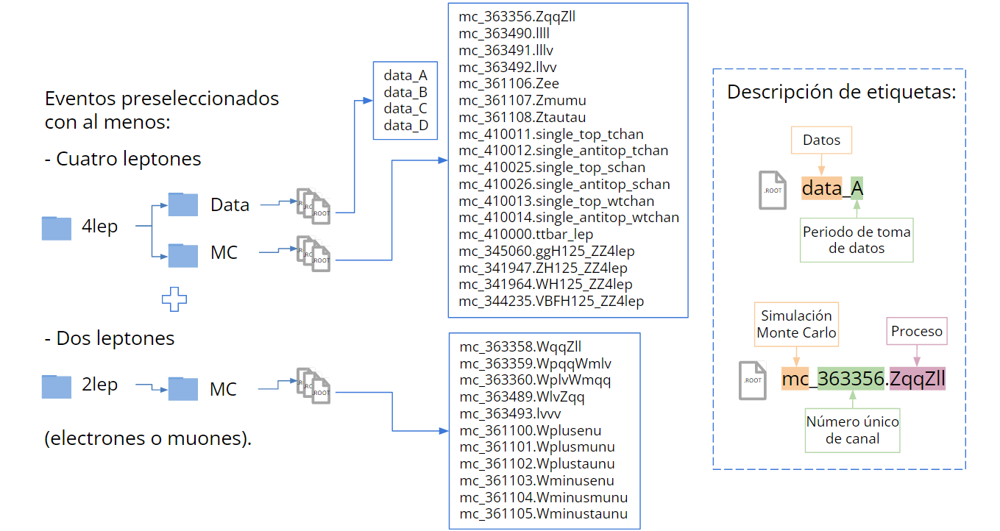
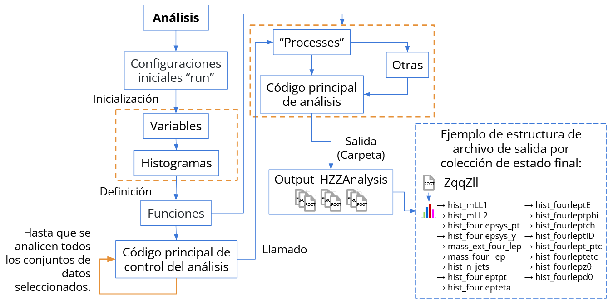
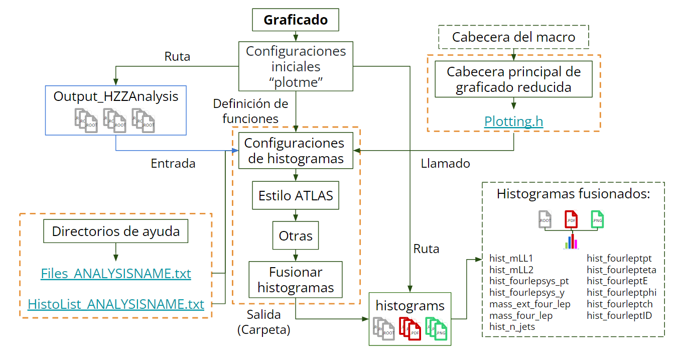

# Propuesta de optimización al análisis computacional del bosón de Higgs en el canal de decaimiento $H\rightarrow ZZ^{*}\rightarrow 4\ell$ a $\sqrt{s} = 13 TeV$ utilizando ATLAS Open Data

Este repositorio documenta, preserva y facilita el acceso a la propuesta de optimización desarrollada en el marco de la tesis de licenciatura titulada “Propuesta de optimización al análisis computacional del bosón de Higgs en el canal de decaimiento $H\rightarrow ZZ^{*}\rightarrow 4\ell$ a $\sqrt{s} = 13 TeV$ utilizando ATLAS Open Data”, defendida el **1 de febrero de 2022** como requisito para optar al título de **Licenciado en Física**.

El trabajo, así como las modificaciones, adaptaciones y mejoras incluidas en este repositorio, fue realizado por el **Br. Oscar Alejandro Altuve Pabon**, estudiante de la **Universidad de Los Andes (ULA)** en Mérida, Venezuela, adscrito al **Departamento de Física**, bajo la supervisión del **Dr. Arturo Sánchez (Colaboración de ATLAS e INAIT.AI)** y el **Prof. Alberto Patiño (ULA)**.

---
### Resumen

En el presente trabajo se realizó una optimización al análisis computacional en C++ del bosón de Higgs dentro del Modelo Estándar de “13 TeV ATLAS Open Data” en el canal de decaimiento $H\rightarrow ZZ^{*}\rightarrow 4\ell$ a $\sqrt{s} = 13\, TeV$ en Jupyter con núcleo ROOT C++ empleando simulaciones MC y datos recolectados por el experimento ATLAS del acelerador LHC (CERN, Ginebra, Suiza) en el año 2016 a energías de centro de masa de $\sqrt{s} =\, 13 TeV$ y luminosidad integrada de $10 fb^{-1}$, para ello se reprodujo el mencionado análisis computacional con el fin de identificar las posibles optimizaciones al código.
En este orden de ideas, se estudió el rango $110 - 135\, GeV$ en el cual se concentran los eventos asociados a candidatos a bosón de Higgs. A los datos experimentales, se les sustrae el fondo simulado de MC; en el histograma resultante se obtuvo que el ajuste de máxima verosimilitud de la PDF de Gauss no describe los eventos asociados a bosón de Higgs; mientras que, al aplicar la PDF de Breit-Wigner describe los eventos con valores muy cercanos a los expuestos por la colaboración ATLAS: la masa invariante tiene un valor de $m_{4\ell}=123.63\pm 0.71\, GeV$ con un nivel de confianza de 95% y el ancho de decaimiento de $\Gamma_{4\ell}=4.25\pm 2.25\, GeV$. A pesar de estos resultados, se reconoce la posibilidad de que no se haya detectado un BH.

**Palabras claves:** Modelo Estándar, bosón de Higgs, 4 leptones, ATLAS Open Data, Jupyter Notebook, ROOT C++, método de máxima verosimilitud, masa invariante, ancho de decaimiento.

---

### Abstract (English)

In this work we made an optimization to the computational analysis in C++ of the Higgs boson within the Standard Model of "13 TeV ATLAS Open Data" in the $H\rightarrow ZZ^{*}\rightarrow 4\ell$ a $\sqrt{s} = 13\, TeV$ decay channel in Jupyter with ROOT C++ kernel using MC simulations and data collected by the ATLAS experiment of the LHC accelerator (CERN, Geneva, Switzerland) in 2016 with center of mass energies of $\sqrt{s} = 13\, TeV$ and integrated luminosity of $10 fb^{-1}$. Then, we reproduced the aforementioned computational analysis in order to identify possible optimizations to the code.
In this study we focused in the range $110 - 135\, GeV$ in which the events associated with Higgs boson candidates are concentrated. The experimental data is supported by the simulated MC background; in the resulting histogram we obtained that the maximum likelihood fit of the Gaussian PDF does not describe the events associated with the Higgs boson; while, when applying the Breit-Wigner PDF, it describes the events with values very close to those exposed by the ATLAS Collaboration: the invariant mass has a value of $m_{4\ell}=123.63\pm 0.71\, GeV$ with a confidence level of 95% and the width decay of $\Gamma_{4\ell}=4.25\pm 2.25\, GeV$. Despite these results, the possibility that a BH may not have been detected is recognized.

**Keywords:** Standard Model, Higgs boson, 4-lepton, ATLAS Open Data, Jupyter Notebook, ROOT C++, maximum likelihood estimation, invariant mass, width decay.

---

### Antecedente. Análisis original:
El estudio base utilizado para esta investigación fue desarrollado por la **ATLAS Collaboration (2019)** dentro del proyecto **ATLAS Open Data**.

- ATLAS Collaboration. (2020). Review of the 13 TeV ATLAS Open Data release (ATL-OREACH-PUB-2020-001). CERN. <https://cds.cern.ch/record/2707171>

- Repositorio original: <[https://github.com/atlas-outreach-data-tools/atlas-outreach-cpp-framework-13tev](https://github.com/atlas-outreach-data-tools/atlas-outreach-cpp-framework-13tev/tree/402cf2afda53e630f6fe5580e53128f39b19daf2)>. Licencia: European Union Public License 1.1.

- Serkin, L., & Sanchez Pineda, A. (2020). ATLAS Open Data 13 TeV analysis C++ framework (v1.1). Zenodo. <https://doi.org/10.5281/zenodo.5501338>

### Objetivos del proyecto

#### Objetivo General
Proponer una optimización al análisis computacional del bosón de Higgs en el canal de decaimiento a $H\rightarrow ZZ^{*}\rightarrow 4\ell$ a $\sqrt{s} = 13 TeV$ utilizando ATLAS Open Data en Jupyter Notebook con núcleo ROOT C++.

#### Objetivos Específicos
- Reproducir el análisis computacional del bosón de Higgs en el canal de decaimiento $H\rightarrow ZZ^{*}\rightarrow 4\ell$ a $\sqrt{s} = 13 TeV$ de ATLAS Open Data en Jupyter Notebook con núcleo ROOT C++.

- Discutir los resultados obtenidos en Jupyter Notebook con núcleo ROOT C++ con el análisis computacional del bosón de Higgs de ATLAS Open Data en el canal de decaimiento $H\rightarrow ZZ^{*}\rightarrow 4\ell$ a $\sqrt{s} = 13 TeV$.

- Optimizar el análisis computacional del bosón de Higgs en el canal de decaimiento $H\rightarrow ZZ^{*}\rightarrow 4\ell$ a $\sqrt{s} = 13 TeV$ basados en la discusión de resultados de la reproducción.

## La estructura del repositorio se describe a continuación:

- **[Local datasets](https://github.com/AltuOs/HZZ4l/tree/master/Local_datasets)** (Herramienta de ejecución opcional)

    - **[Datasets_download.ipynb](https://github.com/AltuOs/HZZ4l/blob/master/Local_datasets/Datasets_download.ipynb)** Descarga del conjunto de datos (datos reales y simulaciones Monte Carlo) para su uso local en caso de ser necesario. Recomendación: ejecutar este proceso una sola vez.

    
    **Fig.** Colecciones de datos para dos y cuatro leptones en el estado final empleados en los análisis.

    ATLAS Collaboration (2020). ATLAS 13 TeV samples collection with at least two leptons (electron or muon), for 2020 Open Data release. CERN Open Data Portal. DOI:[10.7483/OPENDATA.ATLAS.GQ1W.I9VI](http://doi.org/10.7483/OPENDATA.ATLAS.GQ1W.I9VI).

    ATLAS Collaboration (2020). ATLAS 13 TeV samples collection at least four leptons (electron or muon), for 2020 Open Data release. CERN Open Data Portal. DOI:[10.7483/OPENDATA.ATLAS.2Y1T.TLGL](http://doi.org/10.7483/OPENDATA.ATLAS.2Y1T.TLGL).

- **welcome.sh** Para generar/borrar directorios donde se almacenarán los datos analizados e histogramas: ./welcome.sh o source welcome.sh

- **[Analysis](https://github.com/AltuOs/HZZ4l/tree/master/Analysis)**

    - **[Analysis.ipynb](https://github.com/AltuOs/HZZ4l/blob/master/Analysis/Analysis.ipynb)** .

    
    **Fig.** Reproducción del macro de análisis en Jupyter Notebook con núcleo ROOT C++ en el canal de decaimiento $H\rightarrow ZZ^{*}\rightarrow 4\ell$ a $\sqrt{s} = 13\, TeV$.

    - **clean.sh** Para limpiar todas los archivos ".root" generados en el análisis para cada colección de estado final: ./clean.sh o source clean.sh
- **[Plotting](https://github.com/AltuOs/HZZ4l/tree/master/Plotting)**

    - **[Plotting.ipynb](https://github.com/AltuOs/HZZ4l/blob/master/Plotting/Plotting.ipynb)** .

    
    **Fig.** Reproducción del macro de graficado en Jupyter Notebook con núcleo ROOT C++.

    - **clean.sh** Para limpiar los histogramas almacenados en "Plotting/histograms/": ./clean.sh o source clean.sh
- **[Optimization](https://github.com/AltuOs/HZZ4l/tree/master/Optimization)**
    - **[Optimization-MLE-Mass_and_Width.ipynb](https://github.com/AltuOs/HZZ4l/blob/master/Optimization/Optimization-MLE-Mass_and_Width.ipynb)** .
    - **clean.sh** Para limpiar los histogramas almacenados en "Optimization/histograms/": ./clean.sh o source clean.sh
- **[Others](https://github.com/AltuOs/HZZ4l/tree/master/Others)**
    - **[Breit-Wigner_PDF.ipynb](https://github.com/AltuOs/HZZ4l/blob/master/Others/Breit-Wigner_PDF.ipynb)** .
    - **[Gauss_PDF.ipynb](https://github.com/AltuOs/HZZ4l/blob/master/Others/Gauss_PDF.ipynb)** .

 ## Ejecución del código
El análisis puede ejecutarse directamente desde GitHub Codespaces o utilizando la máquina virtual provista en este repositorio:

Arturo Sanchez. (2020). ATLAS-OpenData-VM-ROOT6.18-Ubuntu-18-server-2020-v4 (4.0). Zenodo. <https://doi.org/10.5281/zenodo.3687320>.

El proyecto original fue desarrollado íntegramente dentro de la máquina virtual, con el objetivo de trabajar en local sin depender de la conectividad a internet, garantizar acceso estable a los datos de ATLAS Open Data y asegurar un entorno reproducible para todos los análisis. Para ejecutar la máquina virtual se empleó VirtualBox, disponible en: <https://www.virtualbox.org/>.

A continuación se describen los pasos necesarios para obtener los resultados de optimización, comenzando desde la descarga de los datos.

1. Clonar el repositorio en la máquina virtual o iniciar un entorno en GitHub Codespaces.
Una vez dentro, ejecutar el script ``welcome.sh``, el cual creará las carpetas necesarias para almacenar los datos analizados y los histogramas.

2. Ingresar al directorio ``Local_datasets/`` y ejecutar el notebook ``Datasets_download.ipynb`` para descargar los datos reales y las simulaciones Monte Carlo.

3. Regresar al directorio principal y entrar en ``Analysis/``.
Ejecutar el notebook ``Analisis.ipynb``.
Los resultados del análisis se almacenarán en la carpeta ``Output_HZZAnalysis/`` en archivos con formato ``.root``.

4. Acceder al directorio ``Plotting/`` y ejecutar el notebook ``Plotting.ipynb``.
Los histogramas generados se guardarán en la carpeta ``histograms/``.

5. Realizar la optimización entrando en el directorio ``Optimization/`` y ejecutando el notebook
``Optimization-MLE-Mass_and_Width.ipynb``.
Las salidas correspondientes también se almacenarán en ``histograms/``.

Si se desea repetir alguno de los procesos, pueden utilizarse los scripts ``clean.sh`` disponibles en cada directorio para limpiar los resultados previos.

## Licencia y Atribución

Este repositorio contiene una obra derivada del software original:

**ATLAS Open Data 13 TeV analysis C++ framework**  
Copyright (c) 2018 CERN  
Repositorio original: [https://github.com/atlas-outreach-data-tools/atlas-outreach-cpp-framework-13tev](https://github.com/atlas-outreach-data-tools/atlas-outreach-cpp-framework-13tev/tree/402cf2afda53e630f6fe5580e53128f39b19daf2)

Las modificaciones, adaptaciones y mejoras incluidas en este proyecto fueron desarrolladas por  
**Oscar Altuve (2021–2025)**  
como parte de la tesis de licenciatura:

*“Propuesta de optimización al análisis computacional del bosón de Higgs en el canal de decaimiento $H\rightarrow ZZ^{*}\rightarrow 4\ell$ a $\sqrt{s} = 13 TeV$ utilizando ATLAS Open Data”*  
(defendida el 1 de febrero de 2022).

Todo el código fuente de este repositorio se distribuye bajo los términos de la  
**Licencia Pública de la Unión Europea (EUPL) v1.1 o posterior**.

De acuerdo con la EUPL:
- Se permite el uso, reproducción, modificación y redistribución del código.
- Toda redistribución debe mantenerse bajo la misma licencia (EUPL v1.1 o posterior), salvo en los casos de compatibilidad previstos por la licencia.
- Deben conservarse todos los avisos de copyright y licencia.
- El software se proporciona *“tal cual”*, sin garantías de ningún tipo.
